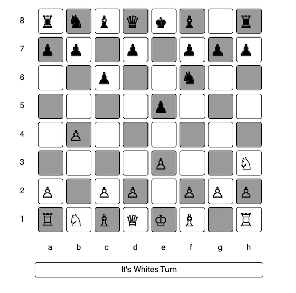

# JavaScript Chess
An interactive chess game built with JavaScript, HTML, and CSS.  
This project allows two players to play chess directly in the browser with standard movement rules and a clean, responsive design.  
🎮 [Play the Game](https://xritchie91.github.io/ChessGame.js/)  

